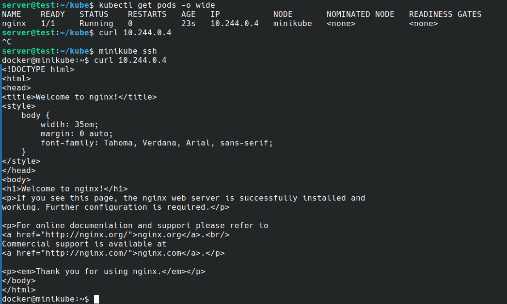

# Deploying and Managing Apps with Kubernetes & Minikube

This guide walks you through deploying and managing an application on a local Kubernetes cluster using Minikube.

---

## What is Minikube?

Minikube is a local Kubernetes environment that lets you create, test, and deploy containerized applications on your own machine. It's ideal for learning, development, and experimentation with Kubernetes concepts.

---

## Tools

- **Minikube** (local Kubernetes cluster)
- **kubectl** (Kubernetes command-line tool)
- **Docker** (for building container images, if needed)

---

## Steps

### 1. Install Minikube and Start the Cluster

Follow the [Minikube installation guide](https://minikube.sigs.k8s.io/docs/start/) for your operating system.

Start Minikube:

```sh
minikube start
```

---

### 2. Create a Deployment YAML for Your App

Example: `deployment.yaml`

```yaml
apiVersion: apps/v1
kind: Deployment
metadata:
  name: my-app
spec:
  replicas: 2
  selector:
    matchLabels:
      app: my-app
  template:
    metadata:
      labels:
        app: my-app
    spec:
      containers:
      - name: my-app
        image: nginx        # Change to your image if needed
        ports:
        - containerPort: 80
```

Apply the deployment:

```sh
kubectl apply -f deployment.yaml
```

---

### 3. Expose the App with a Service

Example: `service.yaml`

```yaml
apiVersion: v1
kind: Service
metadata:
  name: my-app-service
spec:
  type: NodePort
  selector:
    app: my-app
  ports:
    - port: 80
      targetPort: 80
```

Apply the service:

```sh
kubectl apply -f service.yaml
```

---

### 4. Verify Pods and Services

List pods:

```sh
kubectl get pods
```

List services:

```sh
kubectl get services
```

---

### 5. Scale the Deployment

To change the number of replicas (e.g., to 3):

```sh
kubectl scale deployment my-app --replicas=3
```

---

### 6. Describe Resources and View Logs

Describe deployment, pod, or service:

```sh
kubectl describe deployment my-app
kubectl describe pod <pod-name>
kubectl describe service my-app-service
```

Check pod logs:

```sh
kubectl logs <pod-name>
```

---

## Accessing Your App on the Local Network

1. Get the NodePort assigned by Kubernetes:
   ```sh
   kubectl get service my-app-service
   ```
   Look for the `PORT(S)` column (e.g., `80:30080/TCP` — here, `30080` is the NodePort).

2. Get your Minikube IP address:
   ```sh
   minikube ip
   ```
   Suppose it returns `192.168.49.2`.

3. Access your app at:
   ```
   http://<minikube-ip>:<NodePort>
   ```
   Example: `http://192.168.49.2:30080`

---

## Example: Curling the Kubernetes Pod



---

**Outcome:**  
You will have a working Kubernetes cluster running locally with Minikube, and your app will be deployed, exposed, and manageable via `kubectl`.